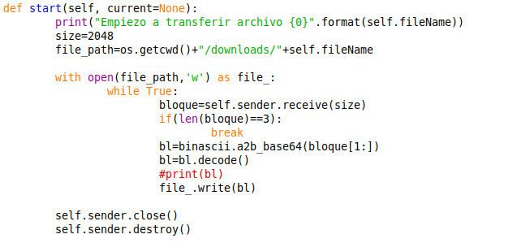
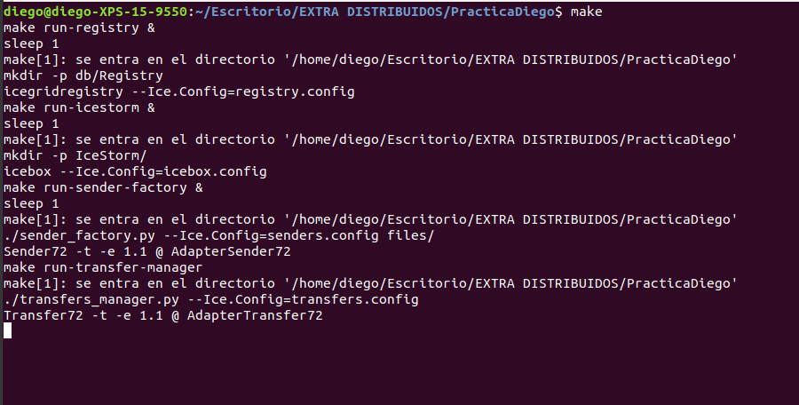
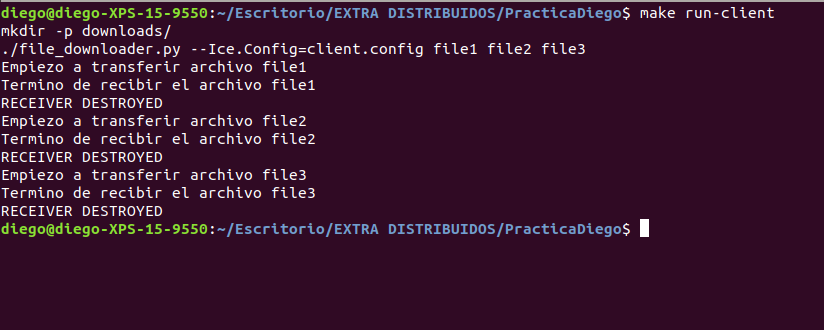
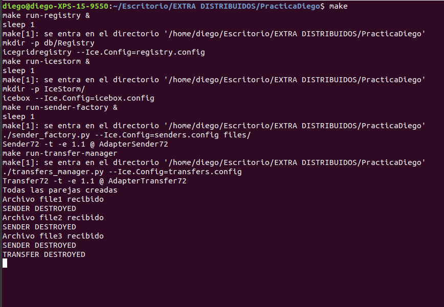
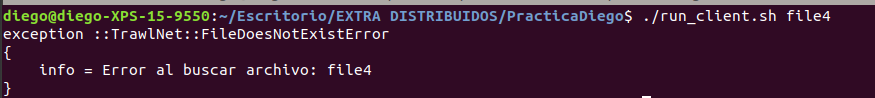
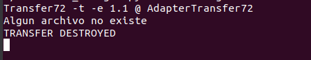

# arche_SSDD

https://github.com/diego10ar/arche_SSDD.git

Diego Arche Claudio

## Que había que hacer:

Para esta práctica de Convocatoria Extraordinaria, se nos pedía la creación de un sistema cliente-servidor que permitiera la descarga de ficheros. Para ello debíamos usar ZeroC Ice con el lenguaje Python teniendo en cuenta los siguientes aspectos:

  - **Transparencia de localización**

  - **Manejo de canales de Eventos**

  - **Despliegue de servidores**

Todo esto debía llevarse a cabo con la especificación que nos pedían en cuanto a las clases a usar y la comunicación a llevar a cabo.

## Que hace mi código:

Soy consciente de que mi código no es completo ya que me ha faltado algo de tiempo para la creación del canal de eventos y no he sido capaz de saber introducirlo estos últimos días. 

Primero realice la práctica más o menos en local, las comunicaciones y creación de Factorías y la he ido pasando al gitHub poco a poco estos últimos días y de paso intentar introducir los canales de eventos pero no he sido capaz como he dicho anteriormente. También pase a realizar el envió del archivo en lo que si he tenido éxito.

Por tanto mi código ejecuta bien los servidores y los mantiene a la escucha y cuando ejecuto el cliente, si el archivo que solicita el cliente existe, comenzara a realizar la transferencia del archivo que sera introducido en la carpeta /downloads/. Una vez que se realiza la transferencia, se elimina el objeto transfer creado y el servidor se mantiene a la escucha para nuevas solicitudes. Por tanto, la creación de las Factorias y las diferentes clases me lo hace bien, la descarga del archivo y comprobación de algunos errores también que serán impresos por pantalla.
A la hora de recibir un archivo, mi método _Start_ del _ReceiverI_, llamará la lectura del sender tantas veces hasta que el tamaño se corresponda a un tamaño igual a 3 que supondrá que ha llegado al final del archivo y la cadena esta vacía.

No he implementado los eventos pero los archivos de configuración para ello si están creados ya que son similares a los de la sesion3 de Laboratorio.

### Problemas con algunas partes del código
En general los problemas que he ido encontrando los he podido solucionar gracias al foro y los apuntes de las sesiones de laboratorio. Sé que he encontrado menos problemas debido a que no he realizado la implementación de los eventos que eso modifica parte del código.

Para las conexiones no he tenido mucho problema ya que para los Proxys he usado nombres comunes cambiando dependiendo de la clase y me ha ayudado mucho los ejemplos de clase para la correcta realización de estas y sobretodo para los archivos de configuración que son semejantes.

Para transferir el archivo he encontrado algún problema ya que en archivos grandes hay que pedir varios bloques hasta que se recibe el archivo completo. A la hora de enviar no tuve problema al ser igual que el **_transfer_factory.py_** de la práctica de ordinario pero a la hora de recibir en la función _start()_ del _ReceiverI()_ tuve que crear un bucle que parara cuando el tamaño del bloque recibido era igual a 3 ya que una vez ha finalizado la lectura solo envía bloques vacíos de ese tamaño. 

 

## Manual de Usuario:

A pesar de no contar con Canal de Eventos, la práctica se realiza correctamente, si hacemos el comando **_Make_** nos realizara bien el despliegue de los servidores y en otro terminal al ejecutar **_Make run-client_** nos envía bien los tres archivos (file1, file2 y file3) que se especifican en el archivo **Makefile**
Una vez realizado esto, el cliente se detendrá y el servidor avisara de los archivos recibidos y lo último sera "**TRANSFER DESTROYED**", Eso si, se mantendrá esperando para nuevas solicitudes.
En las siguientes fotos se puede ver como se realiza la ejecución:

Primero arranco los servidores:

 
 
 
Luego ejecutamos el cliente desde el Make

 
 
 
Y por último vemos como nos notifica en el terminal de los servidores

 
 
 
 Si nos vamos a la carpeta **/downloads** veremos que se han obtenido bien los ficheros si estos eran correctos
 
 En caso de que un archivo no exista obtendremos las siguientes excepciones por parte del cliente:
 
  
  
  Y en la parte del servidor obtendremos la linea: "Algún archivo no existe" y la destrucción del transfer
  
  
  
